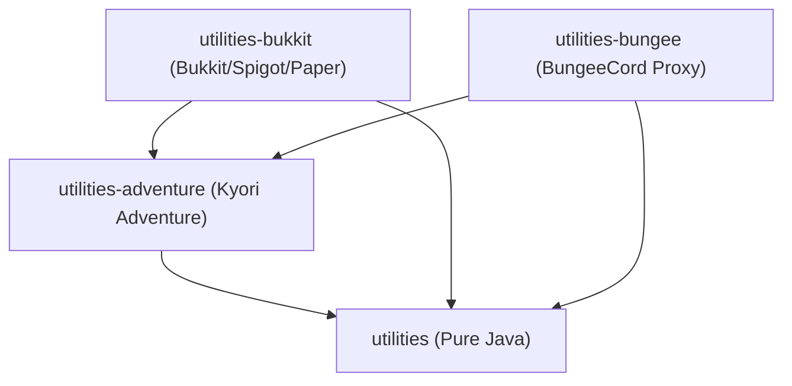

# 🌌 Dream-Utilities Wiki

Welcome to the official documentation for **Dream-Utilities** — a high-performance, modular Java utilities suite designed for Minecraft plugin developers (Bukkit, Paper, BungeeCord, Spigot, Velocity, and standalone Java).

---

## 📚 Documentation Sitemap

| Module | Description | Guide Link |
|---|---|---|
| 🚀 **Getting Started** | Installation, Repositories (Gradle/Maven), Module selection | [Getting Started](Getting-Started) |
| ✨ **utilities-adventure** | Kyori Adventure API, MiniMessage, BossBars, Books, ResourcePacks, Translations, Audience | [Adventure Utilities](Adventure-Utilities) |
| 🟩 **utilities-bukkit** | ItemBuilder, InventoryUtil, VersionUtil (Paper/Spigot/Folia/CalVer), ItemNBT, QueuedTeleport | [Bukkit Utilities](Bukkit-Utilities) |
| 🟧 **utilities-bungee** | BungeeCord StringColorUtil & DefaultColorProcessor | [Bungee Utilities](Bungee-Utilities) |
| 📦 **utilities (Core)** | MathUtil, TimeUtil, Option, ParseUtil, Countdown, Tuple Objects (Duo, Triple, Quad) | [Core Utilities](Core-Utilities) |

---

## 🏗️ Architecture Overview

